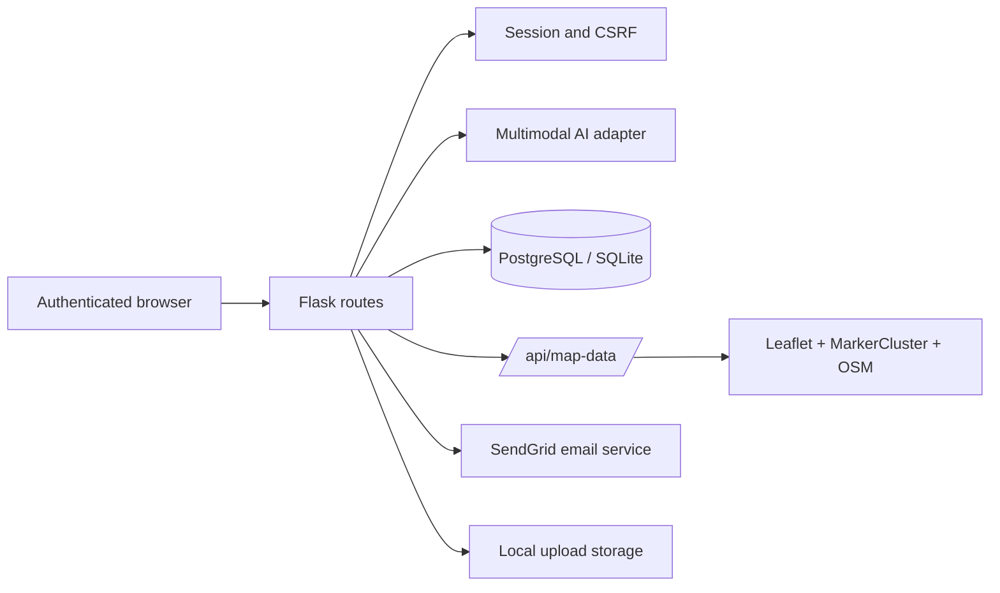

# DamageSense AI Architecture

## System overview

DamageSense AI is a server-rendered Flask 3 application backed by SQLAlchemy. The browser provides the authenticated workspace, optional camera/GPS capabilities, immediate result rendering, history browsing, and the Leaflet map. Flask remains the trust boundary for authentication, CSRF protection, authorization, file validation, model invocation, persistence, audit logging, and exports.

## Request flows

### Assessment flow

The browser submits an image and, when available, a JSON location payload containing latitude and longitude. The upload route validates the file extension and image signature, stores it under a UUID-prefixed filename, invokes `classify_image`, normalizes the structured response, validates location ranges, writes an `Assessment`, records an audit event, and returns the serialized report for immediate rendering.

### Map flow

An authenticated browser loads `/map`, which serves `templates/map.html`. The page calls `/api/map-data`. Administrators receive all assessments; ordinary users receive only their own records. For records created before location capture existed, the response assigns a deterministic estimated response-zone coordinate and includes `location.estimated=true`. The server never treats these fallbacks as device telemetry.

### Migration flow

At application startup, `migrate_legacy_sqlite_schema` inspects the existing schema and adds missing assessment columns with additive `ALTER TABLE` statements. PostgreSQL remains the production source of truth. No startup path drops tables or rewrites existing assessment rows.

## Data model changes

| Entity | Field | Purpose |
|---|---|---|
| `Assessment` | `latitude`, `longitude` | Optional validated GPS coordinates |
| `Assessment` | `location_city`, `location_country` | Optional human-readable location labels for future reverse-geocoding support |
| `Assessment` | `location_source` | `gps` for browser coordinates; absent on legacy records |
| Map response | `location.estimated` | Explicit UI disclosure for fallback legacy/demo placement |

## Frontend architecture

The existing server-rendered pages continue to use Jinja templates and progressive enhancement. The shared `static/theme.css` adds Watermelon UI tokens, semantic severity colors, bento helpers, focus treatment, and reduced-motion behavior. The map page uses Leaflet and Leaflet.markercluster from pinned CDN URLs, with OpenStreetMap attribution. The page remains functional without a map data response by showing an empty/failed summary state rather than inventing live data.

## Security and privacy

Location capture is optional and permission-gated by the browser. The application stores only the coordinates submitted with the assessment. The map endpoint is authenticated and scope-controlled on the server. Provider keys, database URLs, email credentials, and session secrets remain environment variables. Existing admin, verification, reset-token, audit, and CSRF protections are preserved.

## Deployment

Render deploys from `main` using the repository’s existing `render.yaml` start command. Before rollout, ensure PostgreSQL, `FLASK_SECRET_KEY`, model variables, and email variables are configured in Render. After rollout, inspect the migration log, `/health`, an authenticated scan, `/map`, and `/api/map-data`.
